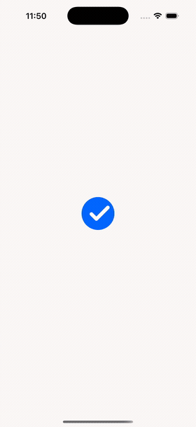
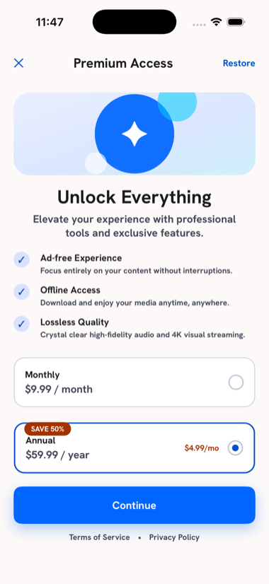
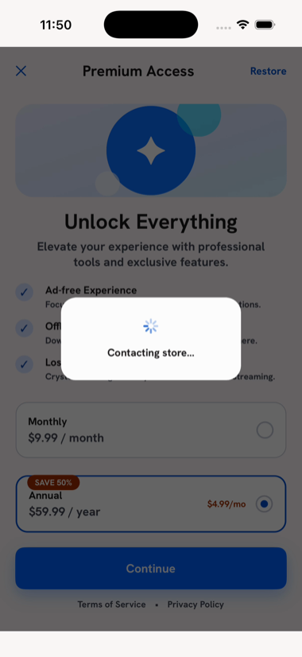
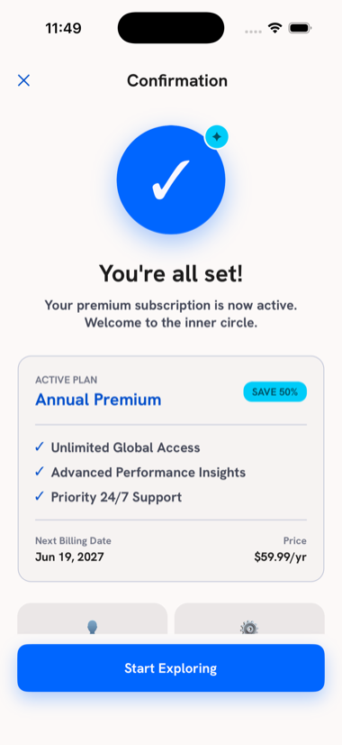
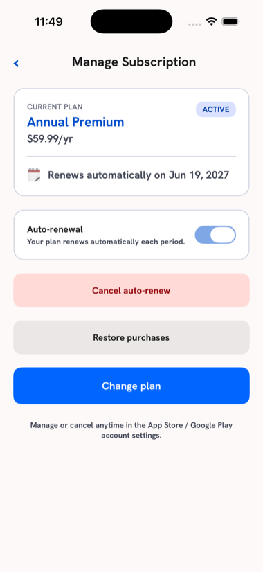
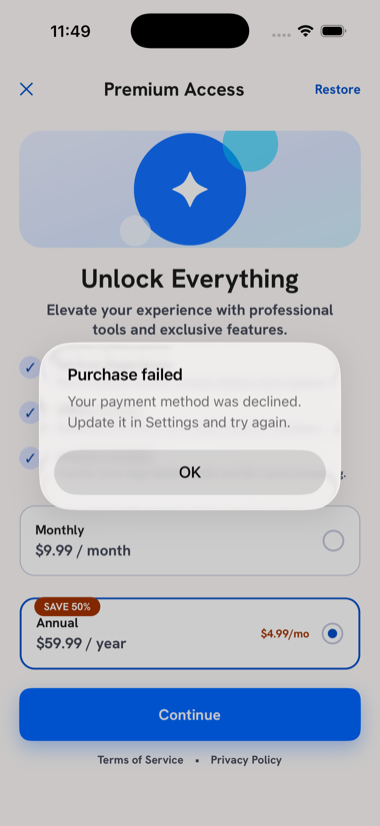
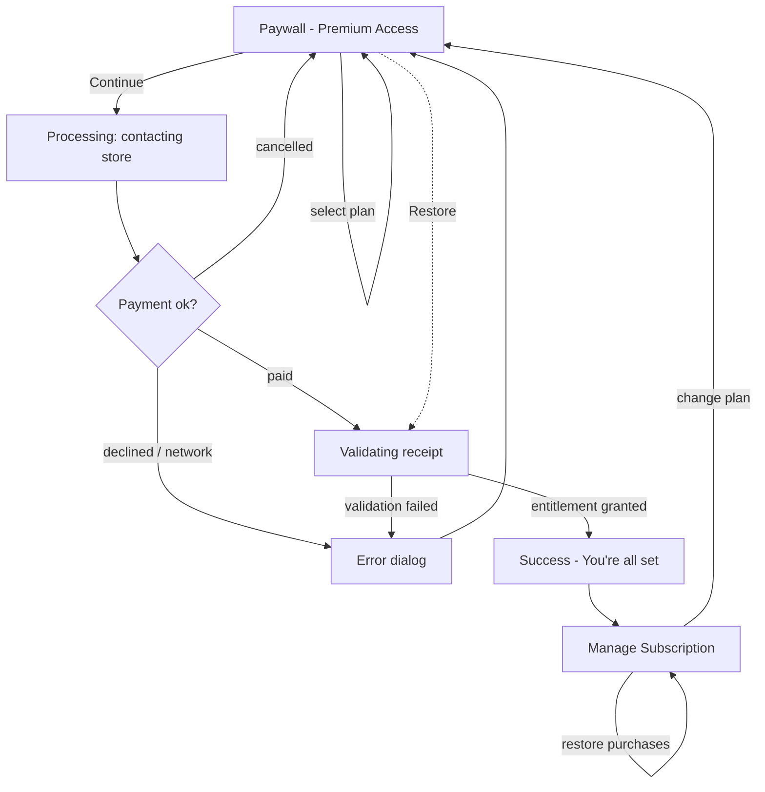

# Premium Access - .NET MAUI Subscription / In-App Purchase

A production-style **.NET MAUI** subscription flow for **iOS and Android**: a high-conversion paywall, the full purchase state machine (selection, processing, receipt validation, success), active-subscription management, restore, and error handling. Built design-first from a Google Stitch design system and driven by a store-agnostic service so the whole flow runs on a simulator with no store account.



## What it shows

- **Subscription screen from a provided UI/UX design** - the paywall is built pixel-for-pixel against a Google Stitch design (`design/`): Action-Blue palette, Hanken Grotesk type scale, plan cards, "SAVE 50%" badge, feature list.
- **Plan selection** - Monthly / Annual products with localized price strings and an effective-rate line, single-select with live visual feedback (2px primary border + filled radio).
- **Purchase processing** - a two-stage overlay ("Contacting store..." then "Validating receipt...") that mirrors the real StoreKit / Play Billing round-trip.
- **Subscription validation** - the entitlement is only granted after receipt validation succeeds.
- **Active subscription management** - current plan, renewal date, auto-renew state, cancel auto-renew, change plan.
- **Purchase restoration** - Restore action on both the paywall and the manage screen (required on iOS).
- **Error handling & user feedback** - declined payment, network, and validation failures surface as clear dialogs; user-cancel is silent. Toggle "Simulate purchase failure" on the paywall to exercise it live.

## Screens

| Paywall | Processing | Success |
| :-----: | :--------: | :-----: |
|  |  |  |

| Manage subscription | Error handling |
| :-----------------: | :------------: |
|  |  |

## Flow



## Architecture

MVVM with `CommunityToolkit.Mvvm`, a single Shell with three routed pages, and one store-agnostic service injected via DI.

```
Views (XAML)            ViewModels                 Services
  PaywallPage    <-->   PaywallViewModel    -->\
  SuccessPage    <-->   SuccessViewModel    -->  ISubscriptionService
  ManagePage     <-->   ManageViewModel     -->/   (MockSubscriptionService)
```

- **`ISubscriptionService`** is the seam between UI and store. A production build supplies a StoreKit 2 implementation on iOS and a Google Play Billing implementation on Android (behind `#if IOS / #if ANDROID` or a DI swap); the methods - `GetPlansAsync`, `PurchaseAsync`, `RestoreAsync`, `GetStatusAsync`, `CancelAutoRenewAsync` - map one-to-one to the platform billing APIs.
- **`MockSubscriptionService`** stands in for the stores with realistic timing and the same state machine, so every screen and edge case is demoable on a plain simulator.
- **Design tokens** (`Resources/Styles/Colors.xaml`, `Styles.xaml`) are lifted straight from the Stitch `design/luminous_flux/DESIGN.md` so the build matches the source design.

### Mapping to real billing APIs

| App action | iOS (StoreKit 2) | Android (Play Billing) |
| --- | --- | --- |
| Load plans | `Product.products(for:)` | `queryProductDetailsAsync` |
| Purchase | `product.purchase()` | `launchBillingFlow` |
| Validate | `Transaction` verification / server receipt check | `Purchase` acknowledge + server verify |
| Restore | `AppStore.sync()` / current entitlements | `queryPurchasesAsync` |
| Status | `Transaction.currentEntitlements` | `queryPurchasesAsync` |

## Tech stack

.NET 9 - .NET MAUI - C# - MVVM (CommunityToolkit.Mvvm) - Shell navigation - XAML - iOS - Android

## Run

```bash
dotnet build -f net9.0-ios -p:RuntimeIdentifier=iossimulator-arm64
```

Then deploy to a booted simulator, or open in Visual Studio / VS Code with the MAUI workload and run. Android: `dotnet build -f net9.0-android`.
